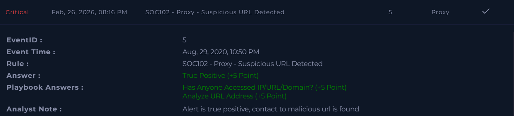

# SOC102 – Proxy – Suspicious URL Detected  

**Platform:** LetsDefend  
**Severity:** Critical  
**Verdict:** True Positive  

## Alert Summary  
Suspicious URL activity was detected via proxy logs. The alert was triggered when a host accessed a malicious URL, which was later confirmed to be associated with malware execution.  

## Event Details  
- **Source Address:** 172.16.17.14   
- **Destination Address:** 198.100.45.154  
- **Destination Hostname:** qstride[.]com  
- **Request URL:** `http[:][/][/]qstride[.]com[/]img/0/`  

## Investigation  
The alert was reviewed according to the playbook. The host accessed the malicious URL **http[:]//qstride[.]com/img[/]0/**. Indicators showed signs of execution of a malicious document file, which then made contact with the domain.  

## Findings  
- Host accessed a malicious URL.  
- Malicious document execution was observed.  
- Contact with the malicious domain was confirmed.  
- Device initially allowed the request, requiring containment.  

## Action Taken  
- Host was contained to prevent further spread.  
- Malicious domain access documented.  
- Preventive measures applied to block similar requests.  

## Conclusion  
This alert was a **true positive**. Suspicious URL activity was confirmed, malicious contact was established, and the host was contained to mitigate impact.  

## Screenshot  
  

## Walkthrough Video  
[YouTube Walkthrough](https://youtu.be/lx6AQjkNo0A)
