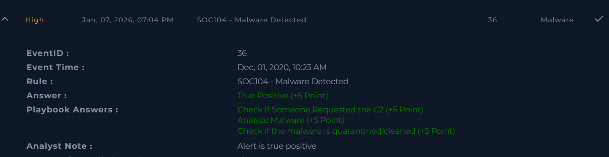

# SOC104 – Malware Detected

Platform: LetsDefend  
Severity: High  
Verdict: True Positive  

## Alert Summary
Malware activity was detected on a user system.  
The content was confirmed as malicious and accessed by the user.

## Event Details
Source Address: 10.15.15.18  
Source Hostname: AdamPRD  
Device Action: Allowed  

## Investigation
The alert was reviewed as per the playbook.  
The user accessed malicious content.  
C2-related activity was observed.  
Malware analysis confirmed it was malicious.  

## Findings
Malicious content was detected.  
The user accessed the malware.  
C2 request was confirmed.  
The malware was not quarantined initially.  

## Action Taken
The affected system was quarantined.  
Further spread was prevented.

## Conclusion
This alert was a true positive.  
Malware activity was confirmed and contained.

## Screenshot

