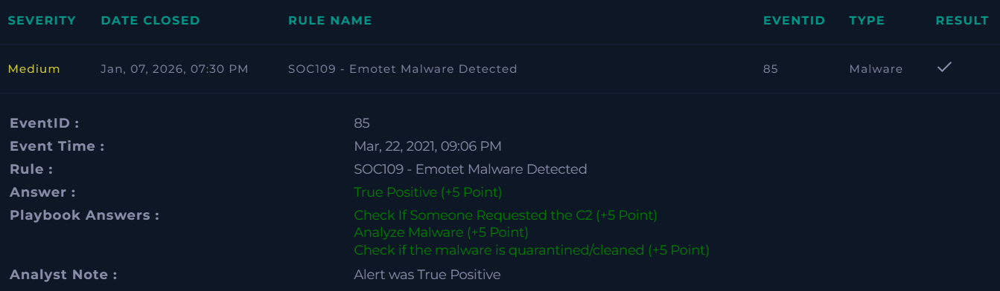

# SOC109 – Emotet Malware Detected

Platform: LetsDefend  
Severity: Medium  
Verdict: True Positive  

## Alert Summary
Emotet malware was detected on a user system.  
The file was malicious but not accessed by the user.

## Event Details 
Source Address: 172.16.17.45  
Source Hostname: RichardPRD  
Device Action: Cleaned  

## Investigation
The alert was reviewed using the playbook steps.  
No C2 communication was requested.  
Malware analysis confirmed the file was malicious.  
The file was not accessed by the user.

## Findings
Emotet malware was detected.  
The file was confirmed malicious.  
No user execution was observed.  
No C2 activity was found.  
The malware was quarantined and cleaned.

## Action Taken
The malicious file was quarantined.  
The system was cleaned successfully.

## Conclusion
This alert was a true positive.  
Malware was present but blocked before execution.

## Screenshot

