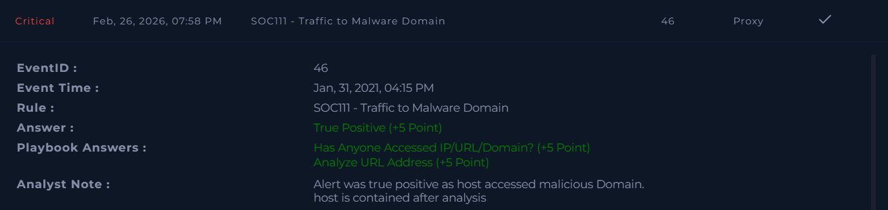

# SOC111 – Traffic to Malware Domain  

**Platform:** LetsDefend  
**Severity:** Critical  
**Verdict:** True Positive  

## Alert Summary  
Traffic to a known malware domain was detected. The alert was triggered when a host attempted to access a malicious executable file hosted on the domain **andaluciabeach.net**.  

## Event Details  
- **Source Address:** 172.16.17.45  
- **Destination Address:** 5.1x5.143.133  
- **Destination Hostname:** andaluciabeach[.]net  
- **Request URL:** `http[:][/][/]andaluciabeach[.]net[/]image[/]network.exe`  
- **User Agent:** Mozilla – Windows  
- **Device Action:** Allowed  

## Investigation  
The alert was reviewed according to the playbook. The host accessed a malicious domain, which was confirmed to be malicious.  

## Findings  
- Host accessed a malicious domain.  
- Activity confirmed as malicious.  
- Device initially allowed the request, requiring containment.  

## Action Taken  
- Host was contained to prevent further spread.  
- Malicious domain access documented.  
- Preventive measures applied to block similar requests.  

## Conclusion  
This alert was a **true positive**. Traffic to a malware domain was confirmed, the host was contained, and escalation was completed to ensure proper handling.  

## Screenshot  

