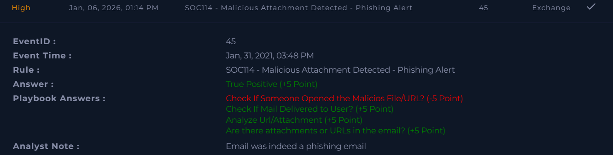

# SOC114 – Malicious Attachment Detected (Phishing Alert)

Platform: LetsDefend  
Severity: High  
Verdict: True Positive  

## Alert Summary
This alert was triggered after a phishing email containing a malicious attachment was detected. Further investigation confirmed that the attachment was accessed by the user, which increased the severity of the incident.

## Email Details
- **Sent Time:** Jan 31, 2021, 03:48 PM  
- **SMTP Address:** 49.234.43.39  
- **Sender Address:** accounting@cmail.carleton.ca  
- **Recipient Address:** richard@letsdefend.io  

## Investigation
The email content itself did not appear suspicious at first glance. However, the presence of an attachment required deeper analysis.

The attachment was analyzed and confirmed to be malicious. Log review showed Exchange-related activity, which indicated that the email was delivered and the attachment was accessed by the user.

No additional endpoint or execution logs were available beyond Exchange logs, so further confirmation of post-execution behavior could not be obtained.

## Findings
- The email content did not appear suspicious  
- A malicious attachment was present in the email  
- The attachment was accessed by the user  
- The activity matched a phishing attack scenario  
- Available logs were limited to Exchange logs  

## Conclusion
This alert was confirmed as a true positive phishing incident. Even though the email content appeared normal, the malicious attachment and user interaction confirmed the threat.

Due to limited log visibility, it could not be fully determined whether the malware executed beyond initial access. However, the alert was handled correctly based on the available evidence.

## Screenshot

## Learning Note
Initially, I missed confirming whether the malicious attachment was accessed by the user. After reviewing the walkthrough and revisiting the alert details, I identified my mistake and corrected the analysis.

This helped me better understand the importance of carefully verifying user interaction with malicious files, especially in high-severity phishing alerts.

