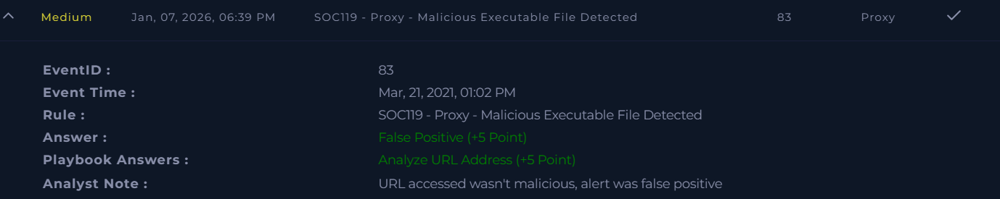

# SOC119 – Proxy – Malicious Executable File Detected

Platform: LetsDefend  
Severity: Medium  
Verdict: False Positive  

## Alert Summary
This alert was triggered by the proxy after a user accessed a URL that was flagged as potentially delivering a malicious executable file. The activity was reviewed to confirm whether the download attempt was actually malicious or a legitimate user action.

## Event Details
- **Source Address:** 172.16.17.x
- **Source Hostname:** SusieHost  
- **Username:** Susie  
- **Destination Address:** 51.195.68.16x  
- **Destination Hostname:** win-rar.com  
- **Request URL:** https://www.win-rar.com/postdownload.html?&L=0&Version=32bit  
- **User Agent:** Chrome – Windows  
- **Device Action:** Allowed  

## Investigation
The request URL was reviewed to understand why the alert was triggered. The destination domain, win-rar.com, is a legitimate website used for downloading the WinRAR application.

The specific URL accessed was related to a normal WinRAR download page. No signs of redirection, suspicious parameters, or malicious behavior were observed during the analysis. The user agent and browsing behavior were consistent with a normal software download initiated by a user.

## Findings
- The destination domain is a legitimate software website  
- The requested URL pointed to a valid WinRAR download page  
- No malicious indicators were identified in the URL  
- User behavior appeared normal  
- Proxy action allowed the request  

## Conclusion
This alert was confirmed as a false positive. The activity was related to a legitimate software download, and no malicious executable was delivered as part of this request.

The alert was closed after verification, and no further action was required.

## Screenshot

