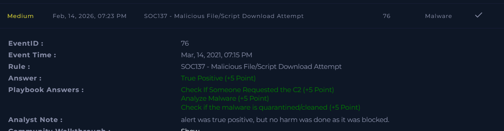

# SOC137 – Malicious File/Script Download Attempt  

**Platform:** LetsDefend  
**Severity:** Medium  
**Verdict:** True Positive  

## Alert Summary  
A malicious file/script download attempt was detected. The alert was triggered when a user system attempted to download suspicious content flagged as potentially harmful. The request was blocked before execution, preventing any damage.  

## Event Details  
- **Event Time:** March 14, 2021, 07:15 PM  
- **Source Address:** 172.16.x7.37   
- **Device Action:** Blocked  

## Investigation  
The alert was reviewed according to the playbook. Malware analysis confirmed the downloaded content was malicious. The device action successfully blocked the attempt, and the malware was quarantined.  

## Findings  
- Malicious file/script download attempt detected.  
- Malware analysis confirmed the file was malicious.  
- The malware was quarantined and cleaned.  
- No evidence of compromise or further impact.  

## Action Taken  
- The alert was documented and closed after validation.  
- Preventive measures were reinforced to block similar attempts.  

## Conclusion  
This alert was a **true positive**. A malicious file/script download attempt was confirmed, but no harm was done as the request was blocked and the malware quarantined.  

## Screenshot  

