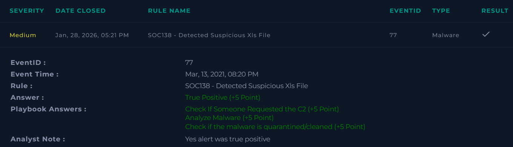

# SOC138 – Detected Suspicious XLS File

**Platform:** LetsDefend  
**Severity:** Medium  
**Verdict:** True Positive  

---

## Alert Summary
A suspicious Excel (XLS) file was detected on a user system.
The file exhibited malicious characteristics and triggered a malware alert.

---

## Event Details
- **Rule Name:** SOC138 – Detected Suspicious XLS File  
- **Source Address:** 172.16.17.56  
- **Source Hostname:** Sofia  

---

## Investigation
The alert was reviewed according to the defined playbook.
- The suspicious XLS file was analyzed
- User interaction with the file was confirmed
- Potential command-and-control (C2) activity was checked
- Malware analysis confirmed the file was malicious

---

## Findings
- A malicious XLS file was detected
- The file was accessed by the user
- Indicators of malicious behavior were observed
- No immediate quarantine action was taken initially

---

## Action Taken
- The alert was classified as a **True Positive**
- Required investigation steps were completed
- Threat was contained

---

## Conclusion
This alert was confirmed as a **True Positive**.
The suspicious XLS file posed a security risk and was successfully identified through investigation.

---

## Screenshot

