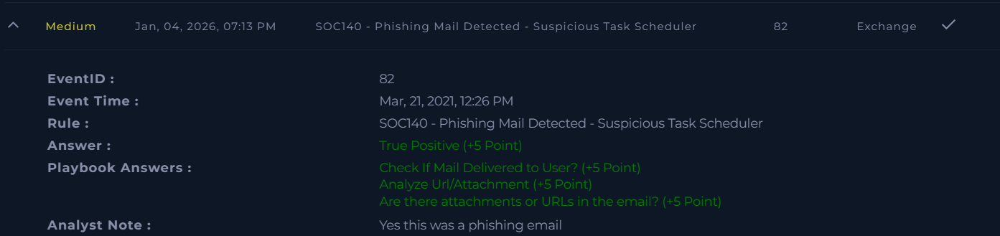

# SOC140 – Phishing Mail Detected (Suspicious Task Scheduler)

Platform: LetsDefend  
Severity: Medium  
Verdict: True Positive  

## Alert Summary
This alert was triggered due to a phishing email that contained suspicious content and attachments. The email showed characteristics commonly associated with phishing activity and required further investigation.

## Email Details
- **Sent Time:** Mar 21, 2021, 12:26 PM  
- **SMTP Address:** 189.162.189.159  
- **Sender Address:** aaronluo@cmail.carleton.ca  
- **Recipient Address:** mark@letsdefend.io  

## Investigation
The email was analyzed to determine whether it posed a real security threat. Upon review, the content of the email was found to be suspicious, and an attachment was present, increasing the potential risk.
The presence of a suspicious attachment combined with the overall email behavior indicated a phishing attempt rather than a legitimate communication.

## Findings
- The email content was confirmed to be suspicious  
- An attachment was included in the email
- Upon analyzing attachment it was found malicious
- The activity matched phishing indicators  
- The email was blocked successfully  

## Conclusion
Based on the investigation, this alert was confirmed as a true positive phishing attempt. The email posed a potential risk to the user; however, it was blocked before causing any impact.

This alert was handled correctly, and no further action was required.

## Screenshot

