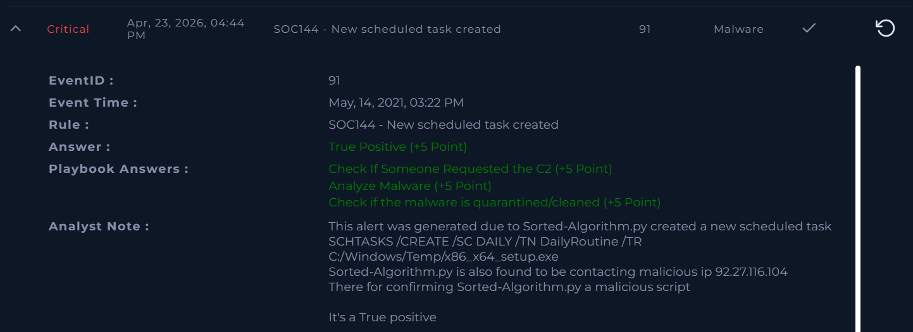

# SOC144 - New scheduled task created

Platform: LetsDefend  
Severity: Critical
Verdict: True Positive  

## Alert Summary
A malicious python file was executed on system which sent outboud connections to malicious C2 server
The content was confirmed as malicious and accessed by the user.

## Event Details
Source Address: 172.16.17.36
Device Action: Allowed  

## Investigation
The alert was reviewed as per the playbook.  
The user accessed malicious content.  
C2-related activity was observed (92.27.x16.104) 
A scheduled task was created : SCHTASKS /CREATE /SC DAILY /TN DailyRoutine /TR C:/Windows/Temp/x86_x64_setup.exe
Malware analysis confirmed it was malicious.  

## Findings
Malicious content was detected.  
The user accessed the malware.  
C2 request was confirmed.  
The malware was not quarantined initially.  

## Action Taken
The affected system was quarantined.  
Further spread was prevented.

## MITRE Mapping
Persistence: Scheduled Task – T1053.005
Command and Control: Application Layer Protocol – T1071

## Conclusion
This alert was a true positive.  
Malware activity was confirmed and contained.

## Screenshot

