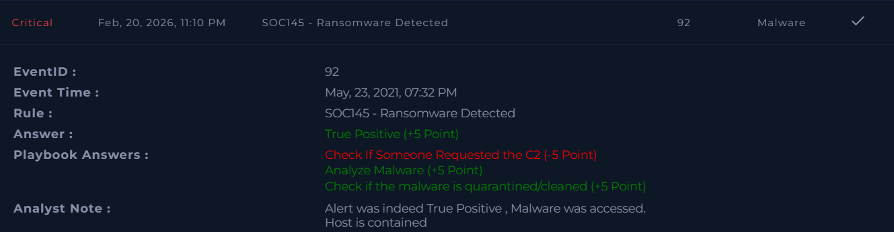

# SOC145 – Ransomware Detected  

**Platform:** LetsDefend  
**Severity:** Critical  
**Verdict:** True Positive  

## Alert Summary  
Ransomware activity was detected on a user system. The alert was triggered when malicious content was accessed, and the host showed signs of compromise.  

## Event Details  
- **Source Address:** 172.16.17.88  
- **Device Action:** Allowed  

## Investigation  
The alert was reviewed according to the playbook. Malware analysis confirmed the ransomware was malicious. The host was contained to prevent further spread.  

## Findings  
- Ransomware activity detected and confirmed.  
- Malicious content was accessed by the user system.  
- Host was contained to prevent further damage.  
- Device action initially allowed the request, requiring containment.  

## Action Taken  
- Host was isolated and contained.    
- Preventive measures applied to block similar ransomware attempts.  

## Conclusion  
This alert was a **true positive**. Ransomware activity was confirmed, the host was contained.

## Learning Note  
During playbook review, the question *“Check If Someone Requested the C2”* was answered incorrectly. I marked it as accessed, but the correct answer was *Not Accessed*. This highlights the importance of carefully validating C2 communication indicators before escalation decisions.  

## Screenshot  

