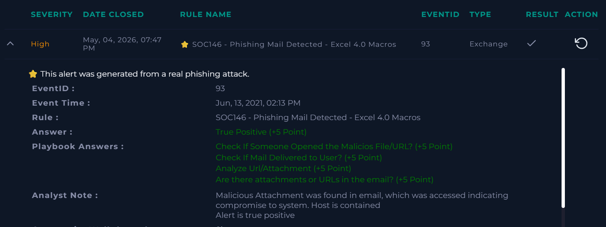

# SOC146 - Phishing Mail Detected - Excel 4.0 Macros

**Platform:** LetsDefend  
**Severity:** High 
**Verdict:** True Positive  

## Alert Summary  
An email with attachment was delivered from external source address to internal company address. Upon investigation attachment was found to be malicious, accessed by the user, Logs showed C2 communications. Host was contained afterwards

## Event Details  
- **Source Address:** trenton@tritowncomputers[.]com
- **Destination Address:** lars@letsdefend[.]io 
- **SMTP Address:** 24.213.22x.54

## Investigation  
The alert was reviewed according to the playbook. An email with malicious attachment was delivered to host. On investigating the attachment on various threat intel platforms it is confirmed attachment was malicious. To find if attachment was opened Logs analysis was done and contact with C2 address was found. Upon checking Endpoint activity it is found regsvr32 command is used to rum XML macro file. Therefore confirming sucessful execution. Host was contained after analysis.

## Findings  
- An email with malicious attachment was delivered to `lars@letsdefend[.]io` from `trenton@tritowncomputers[.]com`.
- Malicious file execution was observed.  
- Contact with the C2 address was confirmed.  
- Device initially allowed the request, requiring containment.  

## Action Taken  
- Host was contained to prevent further spread.  
- Malicious email is deleted.  
- Preventive measures applied to block similar requests.  

## Conclusion  
This alert was a **true positive**. Phishing activity was confirmed, malicious contact was established, and the host was contained to mitigate impact.  

## Screenshot  
  

