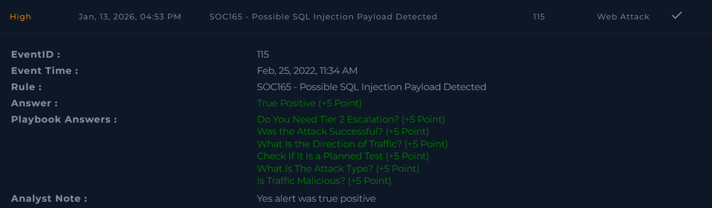

# SOC165 – Possible SQL Injection Payload Detected

Platform: LetsDefend  
Severity: Medium  
Verdict: False Positive (Unsuccessful Attack)

## Alert Summary
This alert was generated when an external IP attempted to access a web server using a SQL injection payload in the URL parameter.

## Event Details
Event ID: 115  
Event Time: Feb 25, 2022, 11:34 AM  
Hostname: WebServer1001  
Destination IP: 172.x6.17.18  
Source IP: 167.99.1x9.17  
HTTP Method: GET  
User-Agent: Mozilla/5.0 (Windows NT 6.1; WOW64; rv:40.0) Firefox/40.1  
Device Action: Allowed  

## Attack Details
The request contained the following URL:

https://172.16.17.18/search/?q=%22%20OR%201%20%3D%201%20--%20-

This payload includes a classic SQL injection pattern using `OR 1 = 1`, which is commonly used to bypass query conditions.

## Investigation
Log analysis confirmed that the request originated from the internet and targeted the web server directly.

Although the request was allowed by the device, the web server returned an HTTP response code **500**, indicating an internal server error. This suggests that the SQL injection attempt was not successfully executed.

No signs of successful exploitation, database access, or data exposure were found during the investigation.

## Findings
- The attack originated from an external IP  
- A classic SQL injection payload was used  
- The request reached the web server  
- HTTP response code was 500  
- No successful SQL injection was observed  

## Conclusion
This alert represents an attempted SQL injection attack, but the attack was unsuccessful. Since there was no evidence of exploitation or data exposure, escalation to Tier 2 was not required.

The alert was closed after verification.

## Screenshot

