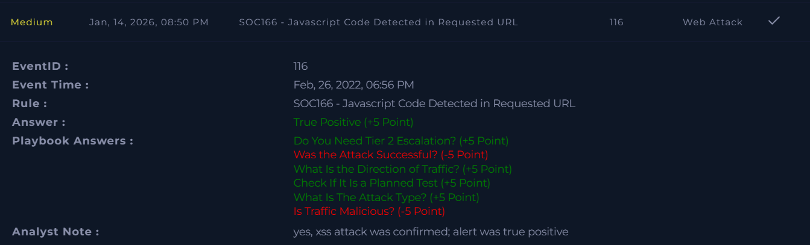

# SOC166 – Javascript Code Detected in Requested URL

Platform: LetsDefend  
Severity: Medium  
Verdict: True Positive  

## Alert Summary
This alert was triggered when an external IP attempted to inject JavaScript code into a web application through a URL parameter. The payload indicated a cross-site scripting (XSS) attempt.

## Event Details
Event ID: 116  
Event Time: Feb 26, 2022, 06:56 PM  
Hostname: WebServer1002  
Destination IP: 172.16.x7.17  
Source IP: 112.85.4x.13  
HTTP Method: GET  
User-Agent: Mozilla/5.0 (Windows NT 6.1; WOW64; rv:40.0) Firefox/40.1  
Device Action: Allowed  

## Attack Details
The following URL was requested:

https://17x.16.17.17/search/?q=<$script>javascript:$alert(1)<$/script>

The request contained embedded JavaScript code, which is a common technique used in XSS attacks to execute scripts in a victim’s browser.

## Investigation
The request originated from an external IP and targeted an internal web server.  
The payload clearly indicated an XSS attempt.

HTTP logs showed a **302 response code**, which indicates redirection, not successful script execution. No evidence was found that the injected JavaScript was executed in a user’s browser.

The affected device was placed into an isolated environment as a precaution. No further malicious activity was observed.

## Findings
JavaScript code was detected in the URL.  
The attack originated from an external source.  
The attack type was confirmed as XSS.  
HTTP response code was 302 (redirection).  
No successful script execution was confirmed.

## Conclusion
This alert was a true positive XSS attempt.  
The attack was detected but not successfully executed.  
There was no impact on users or the system.  
Escalation to Tier 2 was not required.

## Screenshot

## Learning Note
Initially, the HTTP 302 response was interpreted as a successful attack. After review, it was understood that a 302 status code indicates redirection and does not confirm successful XSS execution.

Additionally, traffic was initially marked as non-malicious due to no payload upload or redirection to a malicious site. Upon review, it was clarified that the injected JavaScript payload itself is considered malicious traffic, regardless of execution success.

