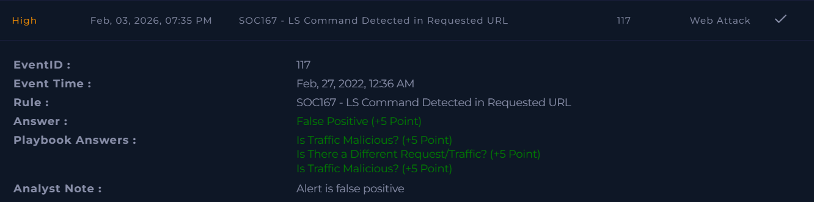

# SOC167 – LS Command Detected in Requested URL  

**Platform:** LetsDefend  
**Severity:** High  
**Verdict:** False Positive  

## Alert Summary  
An alert was triggered due to detection of the substring **"ls"** in a requested URL, which matched the rule for potential command injection attempts. However, the request was simply for a page containing the word **"skills"**, and no malicious activity was observed.  

## Event Details  
- **Destination IP Address:** 188.114.x6.15  
- **Source IP Address:** 172.16.1x.46  
- **Requested URL:** `https://letsdefend[.]io/blog/?s=skills`  
- **Alert Trigger Reason:** URL contains "ls" 

## Investigation  
The alert was reviewed according to the playbook. The detection was triggered by the substring **"ls"** within the word **"skills"** in the requested URL. No evidence of command injection or malicious activity was found.  

## Findings  
- Substring **"ls"** in URL caused the alert.  
- The request was legitimate, targeting a blog search page.  
- No exploitation attempt or abnormal behavior was observed.  

## Action Taken  
- The alert was documented and closed.  
- No escalation was required.  

## Conclusion  
This alert was a **false positive**. The request was benign, and the detection was triggered by normal user activity containing the word **"skills"**.  

## Screenshot

