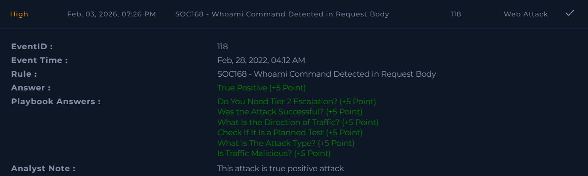

# SOC168 – Whoami Command Detected in Request Body  

**Platform:** LetsDefend  
**Severity:** High  
**Verdict:** True Positive  

## Alert Summary  
A command injection attempt was detected on an internal web server. The alert was triggered because the request body contained the string **"whoami"**, which is a common indicator of command injection attacks. Further analysis confirmed that the attacker attempted to inject multiple commands such as **whoami**, **uname**, and **ls**.  

## Event Details  
- **Destination IP Address:** 172.16.x7.16  
- **Source IP Address:** 61.177.1x2.87  
- **Requested URL:** `https://172.16.x7.16/video/`  
- **Alert Trigger Reason:** Request body contains "whoami" string  

## Investigation  
The alert was reviewed according to the playbook. The request body contained suspicious commands typically used in command injection attacks. Indicators included **whoami**, **uname**, and **ls**, which are commonly leveraged to gather system information and enumerate files.  

## Findings  
- Malicious command injection attempt detected.  
- Attacker attempted to execute system commands via the request body.  
- The activity was confirmed as malicious.  
- Device initially allowed the request, requiring containment actions.  

## Action Taken  
- The affected system was quarantined to prevent further exploitation.  
- Logs were collected for forensic analysis.  
- Preventive measures were applied to block similar requests.  
- **Tier 2 escalation was necessary and performed.**  

## Conclusion  
This alert was a **true positive**. A command injection attack was attempted and confirmed. The malicious activity was contained, Tier 2 escalation was completed, and further spread was prevented.  

## Screenshot  

