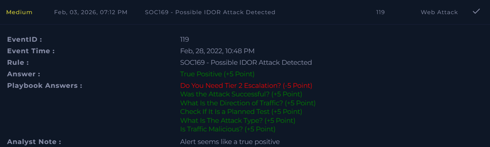

# SOC169 – Possible IDOR Attack Detected  

**Platform:** LetsDefend  
**Severity:** Medium  
**Verdict:** True Positive  

## Alert Summary  
A possible Insecure Direct Object Reference (IDOR) attack was detected on an internal web server. The alert was triggered due to consecutive requests to the same page, which indicated potential unauthorized access attempts.  

## Event Details  
- **Destination IP Address:** 172.16.1x.15  
- **Source IP Address:** 134.209.1x8.137  
- **Requested URL:** `https://172.16.1x.15/get_user_info/`   
- **Alert Trigger Reason:** Consecutive requests to the same page  

## Investigation  
The alert was reviewed according to the playbook. The traffic pattern matched an IDOR attempt, where the attacker tried to access user information through repeated requests. The activity was confirmed as malicious and successful.  

## Findings  
- IDOR attack attempt detected.  
- Consecutive requests indicated unauthorized access attempts.  
- The attack was successful.  
- Malicious traffic originated from external IP **134.209.1x8.137**.  

## Action Taken  
- The alert was documented and escalated.  
- **Tier 2 escalation was necessary and performed.**  
- Preventive measures applied to block similar requests.  

## Conclusion  
This alert was a **true positive**. A successful IDOR attack was confirmed, malicious activity was contained, and Tier 2 escalation was completed.  

## Screenshot  

## Learning Note  
During analysis, the question *“Do You Need Tier 2 Escalation?”* was answered incorrectly. I initially thought escalation was unnecessary since the traffic was already identified as malicious. However, the walkthrough clarified that **if the attack is successful, Tier 2 escalation is recommended**. This highlights the importance of distinguishing between malicious detection and successful exploitation when deciding escalation requirements.  
