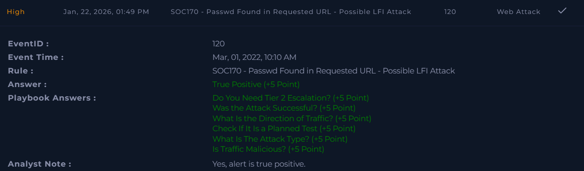

# SOC170 – Passwd Found in Requested URL – Possible LFI Attack  

**Platform:** LetsDefend  
**Severity:** High  
**Verdict:** True Positive  

## Alert Summary  
A potential Local File Inclusion (LFI) attempt was detected on an internal web server. The alert was triggered because the requested URL contained the keyword **"passwd"**, which is commonly associated with LFI attacks.  

## Event Details   
- **Destination IP Address:** 172.16.17.13  
- **Source IP Address:** 106.55.45.162  
- **Requested URL:** `https://172.16.17.13/?file=../../../../etc/passwd`   
- **Alert Trigger Reason:** URL contains "passwd"  

## Investigation  
The alert was reviewed according to the playbook. The request pattern matched a common LFI attempt. However, further analysis confirmed that the attack was unsuccessful and did not compromise the system.  

## Findings  
- Suspicious URL containing **"passwd"** was detected.  
- The request originated from external IP **106.55.45.162**.  
- No evidence of successful exploitation was found.  
- No impact observed on the targeted host.  

## Action Taken  
- The alert was documented and closed after validation.  
- No Tier 2 escalation was required.  

## Conclusion  
This alert was a **true positive**. While the activity resembled an LFI attempt, the attack was unsuccessful and contained without further action.  

## Screenshot

