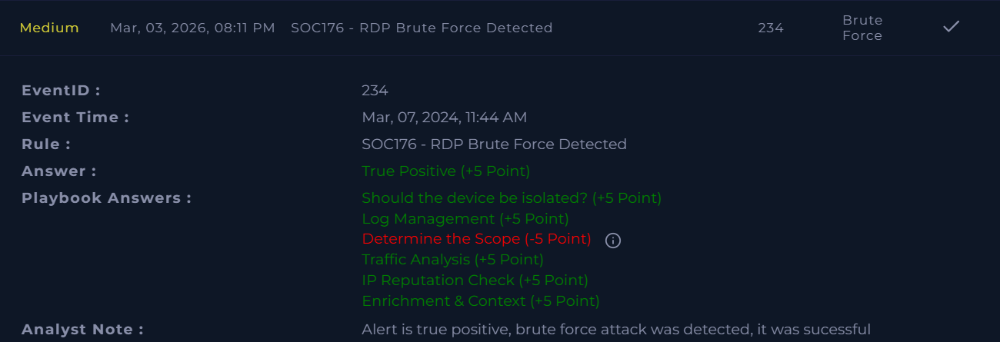

# SOC176 – RDP Brute Force Detected  

**Platform:** LetsDefend  
**Severity:** Medium  
**Verdict:** True Positive  

## Alert Summary  
A brute force attack targeting Remote Desktop Protocol (RDP) was detected. The alert was triggered due to multiple login failures from a single source using different non-existing accounts. The attack was confirmed as successful.  

## Event Details  
- **Source IP Address:** 218.92.0.56  
- **Destination IP Address:** 172.16.17.148  
- **Protocol:** RDP  
- **Firewall Action:** Allowed  
- **Alert Trigger Reason:** Login failure from a single source with different non-existing accounts  

## Findings  
- Brute force attack detected against RDP service.  
- Multiple failed login attempts with non-existing accounts.  
- Attack was successful, indicating credential compromise.  
- Device action initially allowed the traffic.  

## Action Taken  
- Host was isolated to prevent further exploitation.  
- Preventive measures applied to block similar brute force attempts.

## Conclusion  
This alert was a **true positive**. A successful RDP brute force attack was confirmed, the host was contained.

## Learning Note  
During playbook review, the question *“Determine the Scope”* was answered incorrectly. I marked it as *Yes*, but the correct answer was *No*. I misunderstood the requirement — I assumed scope determination was needed since malicious activity was confirmed. However, the walkthrough clarified that scope determination specifically checks if the attacker attempted to brute force **other servers or clients simultaneously**. Since the attack was limited to a single host, the correct answer was *No*.  

## Screenshot  
  

## Walkthrough Video  
[YouTube Walkthrough](https://youtu.be/76dI7F6gmPs)
