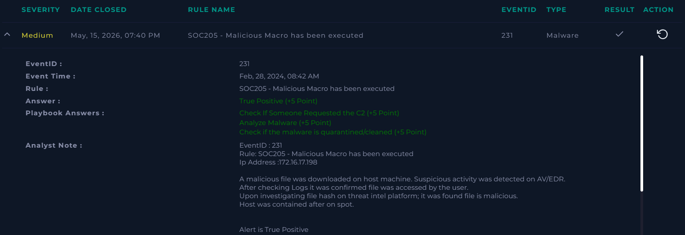

# SOC205 - Malicious Macro has been executed

**Platform:** LetsDefend  
**Severity:** Medium 
**Verdict:** True Positive  

## Alert Summary  
This alert is generated due to suspicious activity detected by AV/EDR software. Suspicios file was a macro file which looked suspicious. After investigating malicious file hash on various threat intel platforms it was confirmed file was malicious.
After checking logs it was found malicious C2 (domain) was accessed by Host, but domain returned 404 error, which confirmed access of malicious file. Host was contained after investigations to prevent further spread.

## Event Details  
- **Ip Address :** 172.16.17.198
- **File hash :** 1a819d18c9a9de4f81829c4cd55a17f767443c22f9b30ca953866827e5d96fb0
- **File name :** edit1-invoice.docm

## Investigation  
The alert was reviewed according to the playbook. Suspicious activity was detected by AV/EDR softwares from a MS word document macro file. The infected host successfully communicated with a known malicious domain. Although the server returned an HTTP 404 response, which means no contact was made at time but as malware created persistance it is high probability that it'll make contact to other C2 servers again. Therefore Host was contained.  

## Findings  
- A suspicious activity was detected by AV/EDR software.
- Malicious file execution was observed.  
- Contact with the C2 address was confirmed, requiring containment.  

## Action Taken  
- Host was contained to prevent further spread.  
- Preventive measures applied to block similar requests.  

## Conclusion  
This alert was a **true positive**. Malicious macro has been executed, malicious contact was established, and the host was contained to mitigate impact.  

## Screenshot  
  

